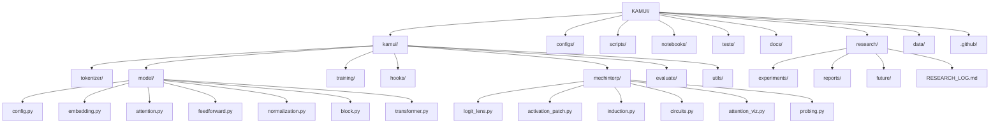
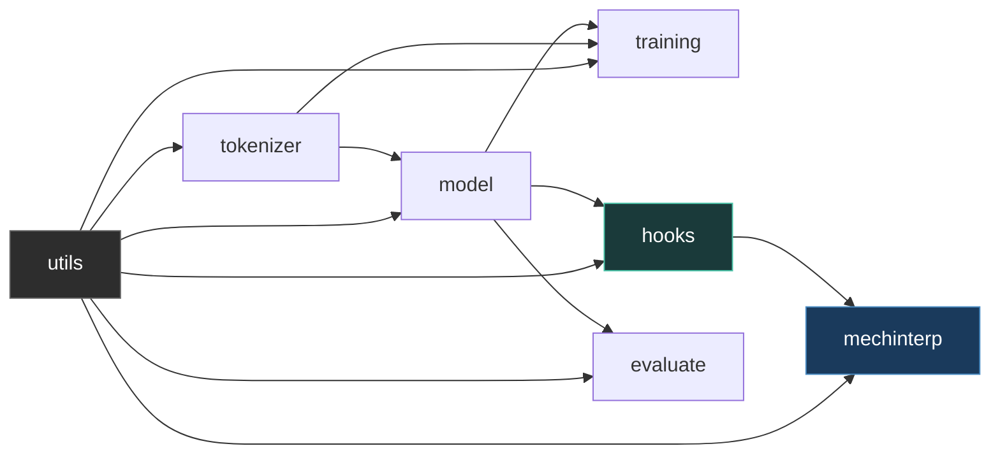
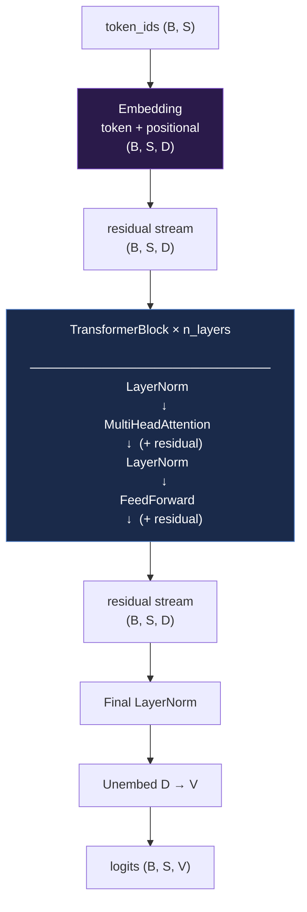
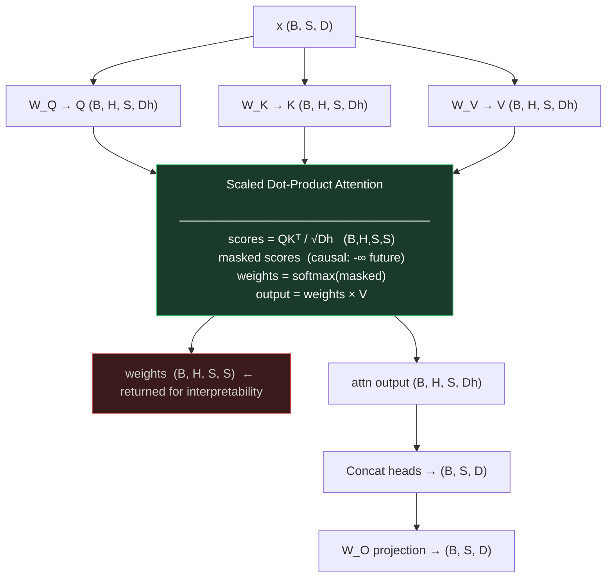
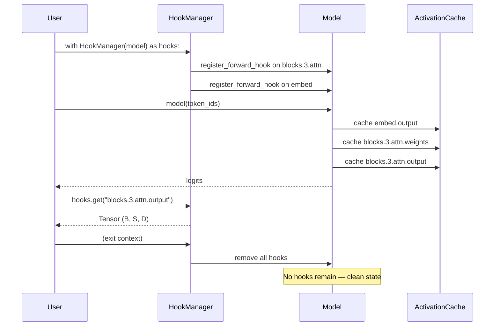
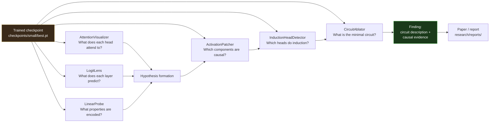
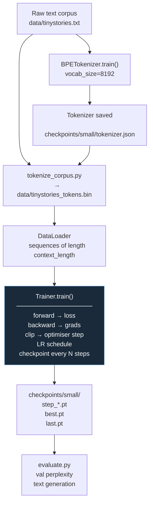

# KAMUI — Architecture Diagrams

All diagrams are written in Mermaid. They render in GitHub markdown,
the mkdocs site, and any Mermaid-compatible viewer.

---

## 1. Repository Structure

---

## 2. Module Dependency Graph

---

## 3. Transformer Architecture

---

## 4. Multi-Head Attention

---

## 5. Hook System

---

## 6. Interpretability Pipeline

---

## 7. Training Pipeline

